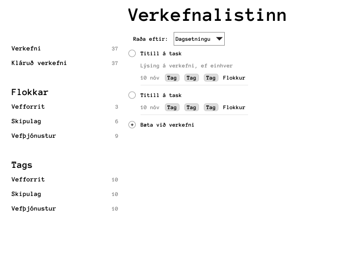

# Vefforritun 1, 2021: Hópverkefni 2

[Kynning í fyrirlestri](https://youtu.be/Alsi_j6skHY)

Verkefnið felst í því að smíða _todo vefforrit_ sem geymir stöðu í vafra notanda.

Hugsa má verkefnið sem high-fidelity prótótýpu af vefforritinu sem unnin er samhliða því að vefþjónustur væru búnar til af öðru teymi.

Þessi prótótýpa er útgáfa 1 (v1) en þegar vefþjónusta væri tilbúin væri farið í útgáfu 2 (v2) þar sem vefþjónusta væri tengd.

## Hópavinna

Verkefnið skal unnið í hóp með 3-4 einstaklingum. Hafið samband við kennara ef ekki er mögulegt að vinna í hóp. Hægt er að leita að félögum á slack á rásinni #vef1-2021-h2-vantar-hop. Ekki er krafa um að halda áfram í sama hóp og áður.

Notast skal við Git og GitHub. Engar zip skrár með kóða ættu að ganga á milli í hópavinnu, heldur á að „committa“ allan kóða og vinna gegnum Git. Gert er ráð fyrir að allir meðlimir í hóp taki þátt í verkefni og séu virk á GitHub.

## Lýsing á verkefni

`README.md` skrá skal vera í rót verkefnis og innihalda:

* Upplýsingar um hvernig keyra skuli verkefnið
  * `npm run dev` eða `npm start` skal annaðhvort að vera til staðar
  * `npm run lint` eða `npm start` skal vera til staðar og keyra lintera
* Lýsingu á uppsetningu verkefnis, hvernig því er skipt í möppur, hvernig CSS/Sass er skipulagt og fleira sem á við
* Upplýsingar um alla sem unnu verkefni, nöfn, HÍ notendanöfn og GitHub notendanöfn

## Tæki og tól

Verkefnið skal innihalda `package.json` og `package-lock.json` sem innihalda öll notuð tól.

Þegar verkefnið er sótt verður `npm install` keyrt á undan öllum öðrum skipunum.
Setja skal upp Sass og stylelint með `stylelint-config-sass-guidelines` og `stylelint-config-standard` fyrir verkefnið.
Setja skal upp eslint með airbnb staðli, líkt og farið var yfir í fyrirlestri. Valkvæmt er að setja upp prettier.

## Hýsing

Setja skal upp verkefnið á Netlify og tengja við GitHub.

## Þarfagreining

Það sem fylgir er textalýsing á þörfum verkefnis.

Ef spurningar vakna um þarfalýsingu er hægt að spyrja á #vef1-2021-h2 slack rásinni.

### Gagnamódel

* `id`, einstakt auðkenni fyrir verkefni
* `title`, titll verkefnis, má ekki vera tómur
* `description`, lýsing á verkefni, má vera tómt
* `category`, flokkur verkefnis, má vera tómur eða nákvæmlega einn flokkur sem til er eftir auðkenni, sjá að neðan
* `tags`, fylki af töggum, má vera tómt
* `priority`, boolean gildi, hvort verkefni sé mikilvægt
* `completed`, hvort verkefni sé klárað eða ekki
* `due`, hvenær verkefni skal klárast í timestamp formi, má vera `null`
* `modified`, dagstími í timestamp formi hvenær verkefni var seinast breytt. Notast þegar gögn eru _syncuð_, sjá að neðan
* `deleted`, hvort verkefni hafi verið eytt, sjá að neðan

Fyrir flokka, þá eru allir mögulegir flokkar skilgreindir í gefnum gögnum. Hver flokkur hefur:

* `id`, einstakt auðkenni flokks
* `title`, titill flokks

### Gefin gögn

Þar sem vefþjónustur eru ekki tilbúnar, en búið er að skilgreina gagnamódel, þá eru gefin gögn sem fylgja því gagnamódeli í `data.json`. Verkefnin eru einhver af þeim sem vinna þarf í verkefninu, bæði fyrir vef og vefþjónustur.

Þegar vefur er opnaður skal:

* sækja þessa skrá
* athuga hvort _öll_ gögn úr henni hafi verið flutt inn (importuð)
  * ef svo, ekki gera neitt
  * ef ekki, færa inn þau gögn sem ekki hafa nú þegar verið flutt inn

Hugsa skal þessa virkni sem „placeholder“ virkni fyrir það þegar vefþjónusta í útgáfu 2 myndi gefa nýjustu gögn fyrir notanda. Þetta væri til þess að hægt væri að halda gögnum notanda í _sync_ á milli mismunandi útgáfa, t.d. vefs og apps.

Þegar verkefni er klárað eða því eytt, þarf að passa upp á að geta viðhaldið þeirri stöðu gegnum vefþjónustu. T.d.

* Verkefni með id `1` er í upprunalegu gögnum
* Verkefni `1` er klárað og það er ekki lengur birt
* Þegar vefur er keyrður aftur upp þarf að horfa til `modified` gildis og ekki uppfæra (þ.e.a.s. merkja verkefnið sem óklárað) þegar sync er keyrt

Annað dæmi:

* Verkefni með id `1` er í upprunalegu gögnum
* Verkefni með id `1` er eytt
* Geyma þarf verkefnið áfram í gögnum þ.a. það sé ekki syncað aftur þegar sync er keyrt. Það er hægt með því að nota _soft delete_, boolean breytu sem segir til um hvort gögnum hafi verið eytt eða ekki, án þess að fjarlægja
* Þegar vefur er keyrður aftur upp á verkefnið ekki að birtast aftur

Huga þarf að því að birta loading state, error state, og state fyrir tóm gögn: hvort sem það eru engin verkefni yfirhöfuð, eða valinn er tómur flokkur eða tagg.

### Vistun gagna

Þegar átt er við gögn skal vista þau í [`localStorage`](https://developer.mozilla.org/en-US/docs/Web/API/Window/localStorage). Það þýðir að eftir að forrit er opnað og gefin gögn eru sótt, er hægt að klára, eyða, eða bæta við verkefnum. Allar þær breytingar eiga að vera vistaðar þ.a. ef notandi endurhleður síðu eða kemur að aftur daginn eftir, eru öll verkefnin nákvæmlega eins.

Útfærslulega séð skal útfæra sér virkni (sér JavaScript module í sér skrá) sem sér um að sækja, vista og uppfæra gögn í `localStorage`.

Hugsa skal virkni þ.a. að í næstu útgáfu af forriti sé hægt að vinna í verkefnalista án nettengingar, en þegar nettenging kemst á, þá sé hægt að synca frá vefforriti í vefþjónustu svo gögn notanda séu rétt geymd miðlægt.

### Viðmót og virkni

Búa skal til allt viðmót og virkni með HTML, CSS og JavaScript _án þess að nota utanaðkomandi framework_, þ.e.a.s. aðeins nota það sem farið hefur verið yfir í námskeiði og notað í verkefnum.

Forritið skal:

* Sækja gögn og synca, eins og lýst er að ofan
  * Meðan gögn eru sótt eða vistuð skal huga að því að sýna viðkomandi stöður (loading, error, tómt, gögn)
* Vista gögn jafnóðum og gögnum er breytt, eins og lýst er að ofan
* Sýna skal valmynd með möguleikum, þegar hver möguleiki er valinn skal gefa það til kynna í valmynd
  * `Verkefni`, þegar smellt er á skal sýna yfirlit með öllum verkefnum sem ekki eru kláruð
  * `Kláruð verkefni`, þegar smellt er á skal sýna yfirlit með öllum verkefnum sem hafa verið kláruð
  * `Flokkar`, allir mögulegir flokkar eru sýndir undir yfirheiti, þegar smellt er á flokk eru aðeins verkefni í þeim flokk sýnd
  * `Tags`, öll möguleg tags eru sýndir undir yfirheiti, þegar smellt er á tag eru aðeins verkefni með það tag sýnd
  * Fyrir alla möguleika skal sýna fjölda verkefna sem eiga við (heiltala, `0` eða stærri)
* Yfirlit skal sýna öll verkefni sem eiga við valinn möguleika, með þeim eiginleikum per verkefni sem lýst er að neðan. Sjálfgefið má velja eftir hverju er raðað, t.d. titli. Hægt er að raða verkefnum eftir:
  * Titli
  * Hvenær skal klárast (`due`), næst í tíma fyrst
  * Forgangi, þá verkefni í forgangi efst, síðan raðað í `due` röð
* Hvert verkefni skal sýna:
  * „Checkbox“, ef smellt er í það skal klára verkefnið (setja `completed = true`)
  * Titil
  * Lýsingu ef einhver
  * Dags þegar á að klárast, ef einhver á stuttu formi (t.d. `10. nóv`, `24. des`)
  * Tags, ef einhver í lista með aðgreiningu frá flokki
  * Flokkur ef einhver
* Þegar smellt er á verkefni í lista skal birta möguleika til að breyta verkefni:
  * Titli
  * Lýsingu
  * Hvenær á að klárast
  * Hvort í forgangi eða ekki
  * Flokkur, val með dropdown
  * Tags, input reitur sem aðgreinir tags með bili
  * Takki til að eyða verkefni
* Alltaf fyrir neðan verkefnalista skal birta takka sem leyfir að búa til nýtt verkefni sem tekur við sömu gögnum og þegar verkefni er breytt

### Útlit

Útlit er ekki aðalatriði verkefnis, en það skal þó vera nógu gott til að vera nothæft. Nota skal Sass og skipta því upp í skrár með stillingum/breytum.

Vefur skal vera skalanlegur og virka frá `400px` upp í a.m.k. `1000px`.

Hér er hugmynd að því hvernig útlit gæti verið:

## Mat

* 20% — `README` eftir forskrift, tæki og tól uppsett, vefur keyrir á Netilfy
* 20% — Útlit
* 30% — Gagnamódel, gefin gögn og vistun gagna
* 30% — Viðmót og virkni

## Sett fyrir

Verkefni sett fyrir í fyrirlestri mánudaginn 1. nóvember 2021.

## Skil

Tilnefna skal hópstjóra sem skráir sig í ákveðinn hóp undir „Hópverkefni 1“ í Canvas. Aðrir nemendur skrá sig í framhaldinu í sama hóp.

Hópstjóri skal skila fyrir hönd allra og skila skal í Canvas í seinasta lagi föstudaginn 26. nóvember.

Skil skulu innihalda:

* GitHub notendanöfn allra (passa þarf að allir nemendur séu í hópnum!)
* Skilaboð skulu innihalda slóð á GitHub repo fyrir verkefni, og dæmatímakennurum skal hafa verið boðið í repo ([sjá leiðbeiningar](https://docs.github.com/en/free-pro-team@latest/github/setting-up-and-managing-your-github-user-account/inviting-collaborators-to-a-personal-repository)). Notendanöfn þeirra eru:
  * `alli959`
  * `einarpalsson`
  * `HallurKrist`
  * `oscar6662`
  * `thth168`
* Slóð á verkefnið keyrandi á Netlify

## Einkunn

Sett verða fyrir tíu minni verkefni þar sem átta bestu gilda 5% hvert, samtals 40% af lokaeinkunn.

Sett verða fyrir tvö hópverkefni þar sem hvort um sig gildir 10%, samtals 20% af lokaeinkunn.

> Útgáfa 0.1
